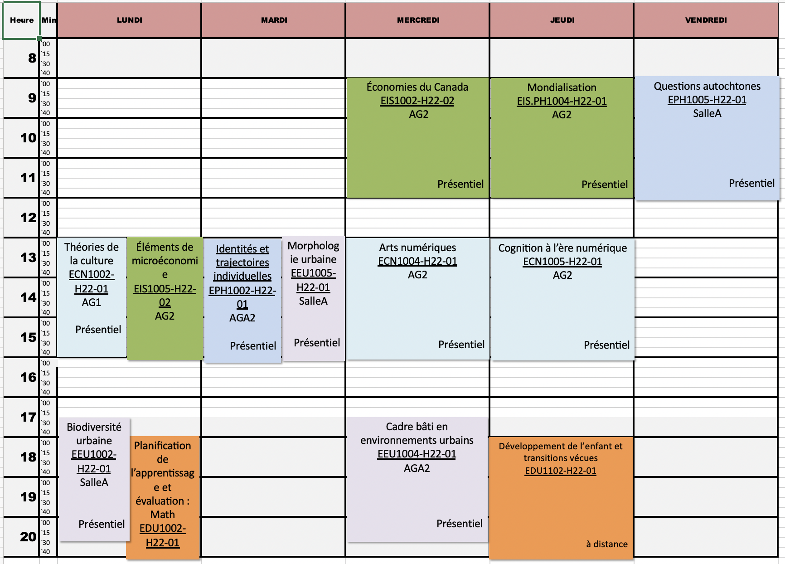

# H22

https://moodle.uof.ca

[🟢 ECN - Études des cultures numériques](https://moodle.uof.ca/course/index.php?categoryid=3)

[🟢 EPH - Études de la pluralité humaine](https://moodle.uof.ca/course/index.php?categoryid=6)

[🟢 EIS - Études de l’économie et de l’innovation sociale](https://moodle.uof.ca/course/index.php?categoryid=4)

[🟢 EEU - Études des environnements urbains](https://moodle.uof.ca/course/index.php?categoryid=5)

[🟢 UOF - Études transdisciplinaires](https://moodle.uof.ca/course/index.php?categoryid=2)

[🟢 EDU - Introduction à la pédagogie](https://moodle.uof.ca/course/index.php?categoryid=7)

[🟢 GOV - Gestion et gouvernance des organisations](https://moodle.uof.ca/course/index.php?categoryid=8)

[🟢 COS - Cours Cosiglés](https://moodle.uof.ca/course/index.php?categoryid=1)

